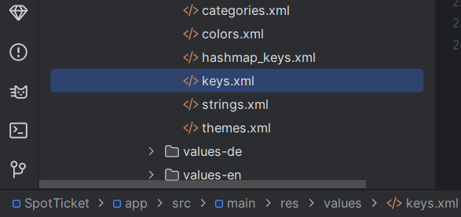
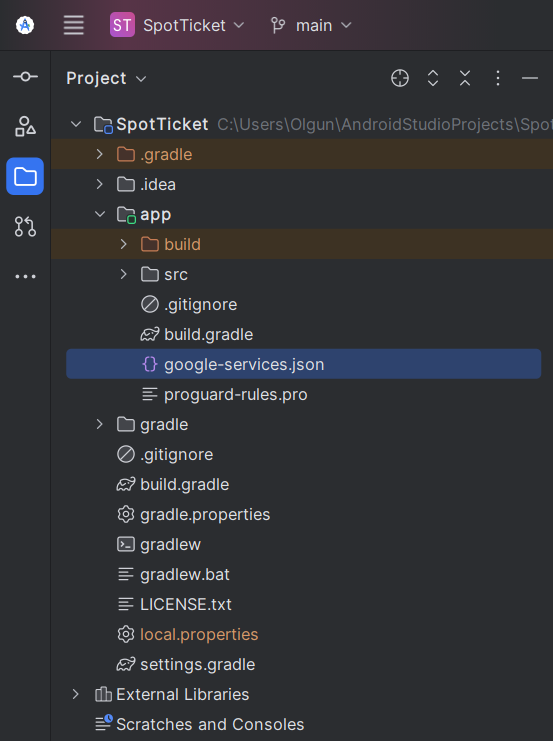

# SpotTicket

## Cloning the Project

This guide contains the necessary steps to clone and run the SpotTicket Android project.

### Requirements

- **Java Development Kit (JDK)**: JDK 8 or higher
- **Android Studio**: Latest version
- **Git**: To clone the project

### Step 1: Install Git

If Git is not installed, download and install the appropriate version for your operating system from the [official Git website](https://git-scm.com/downloads).

### Step 2: Clone the Project

1. Open Terminal or Command Prompt.
2. Use the following command to clone the project:

   ```bash
   git clone https://github.com/olgun-yilmaz/SpotTicket.git
   ```

### Step 3: Open Android Studio

1. Launch Android Studio.
2. Click on "Open an existing Android Studio project."
3. Select the directory of the cloned project and click "OK."

### Step 4: Synchronize Gradle Dependencies

When the project opens, Android Studio will automatically try to synchronize the Gradle dependencies. If synchronization does not happen automatically, click the "Sync Now" button at the top to synchronize manually.

### Step 5: Set Up Required API Keys

The project uses Ticketmaster, Google Maps, and Firebase APIs. You can obtain the necessary API keys from the following links:

- **Ticketmaster**: [Ticketmaster Developer Portal](https://developer.ticketmaster.com/)
- **Google Maps**: [Google Maps Platform](https://developers.google.com/maps/documentation/javascript/get-api-key)
- **Firebase**: [Firebase](https://firebase.google.com/)

#### Update the `keys.xml` File

Don't forget to add the relevant keys to your `keys.xml` file:

```xml
<string name="ticketmaster_base_url">https://app.ticketmaster.com/discovery/v2/</string>
<string name="ticketmaster_api_key">YOUR_API_KEY</string>
<string name="maps_base_url">https://maps.googleapis.com/maps/api/</string>
<string name="maps_api_key">YOUR_API_KEY</string>
```

<p align="center">
    
</p>

#### Update the `local.properties` File

You should add your Google Maps API key to the `local.properties` file. Also, make sure you have enabled the necessary permissions for the Maps API:

```properties
MAPS_API_KEY="YOUR_API_KEY"
```

#### Firebase Setup

Place the `google-services.json` file you downloaded from Firestore into the `app` folder:

<p align="center">
    
</p>

---

### Step 6: Run the Application

1. Connect your Android device or emulator.
2. Click the "Run" button in Android Studio or press `Shift + F10`.
3. The application will start on the connected device or emulator.

### Troubleshooting

- **Gradle Synchronization Error**: Update your Gradle version or check the version numbers in the `build.gradle` file.
- **API Key Error**: Ensure that your API key is correct and that the necessary permissions have been granted.

### Contribution

If you would like to contribute to the project, please refer to the [CONTRIBUTING.md](CONTRIBUTING.md) file for detailed instructions on how to create a pull request. You can also use the `issues` tab for any bugs or suggestions.

### License

This project is licensed under the Apache License 2.0. For more information, please check the `LICENSE` file.

---
